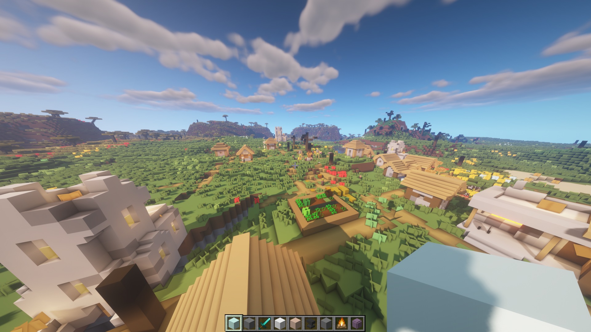
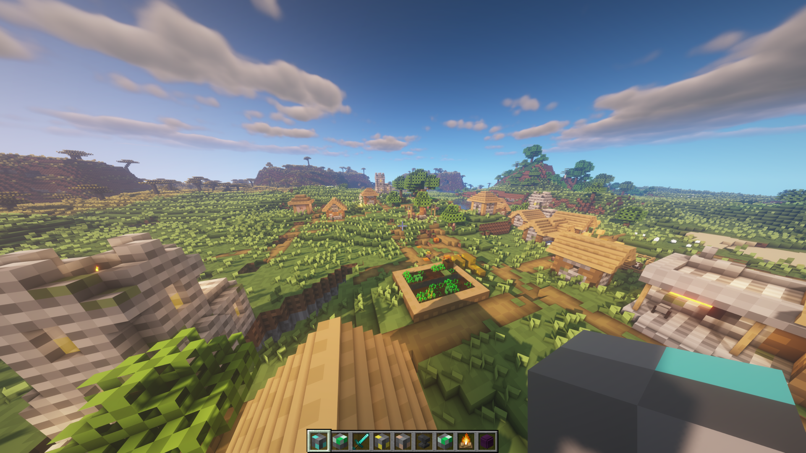
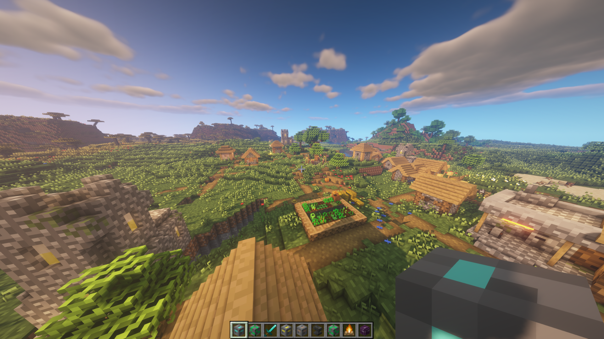
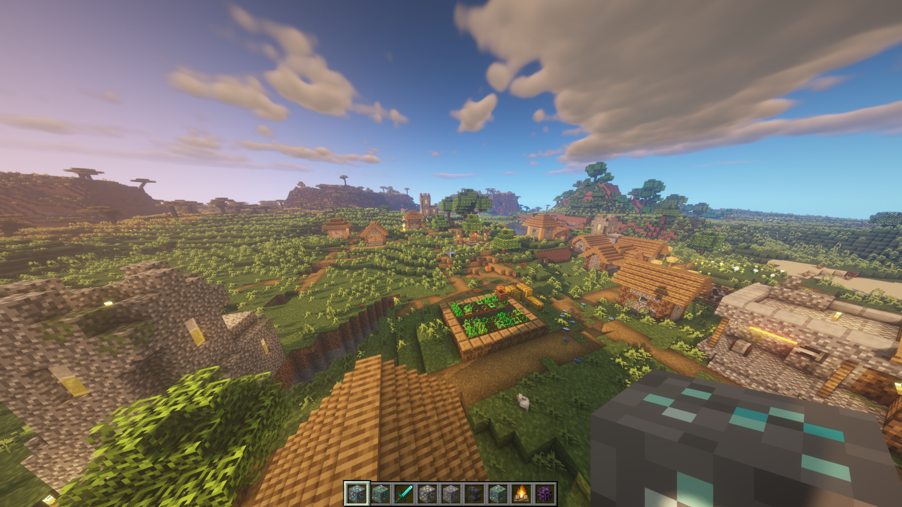
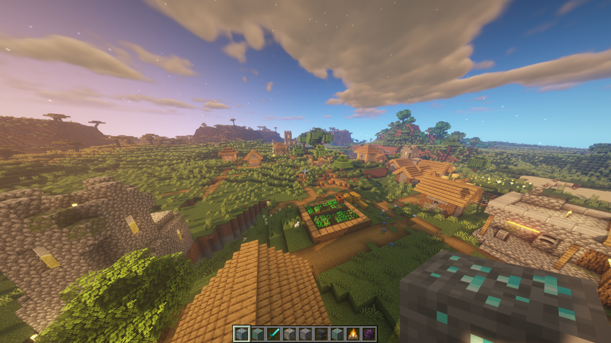

# DownscaledMC
Generated downscaled Minecraft block textures.

## Download
Resource packs can be downloaded at [releases](https://github.com/Jaapp-/DownscaledMC/releases).

## Screenshots
[BSL Shaders](https://bitslablab.com/) were used in these screenshots.

### 1x1

### 2x2

### 4x4

### 8x8

### 16x16

## Building
**Requirements**
- Linux
- Minecraft at `~/.minecraft` with the selected version installed
- ImageMagick

**Generate the resource packs**
1. Set `VERSION=` to extract sources from the desired Minecraft version
2. Run generate.sh
3. Resource packs are now installed to `~/.minecraft/resourcepacks/`, they can also be found in `dist/`

